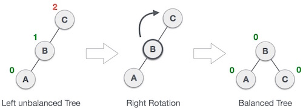
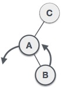
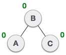

# Tree


### Binary Search Tree

  * Construct : build a balanced Binary Search Tree from an array
    - If the array is unordered, shuffle the elements before build to BST, insert one by one, to make a balanced tree.
    - If the array is sorted, making middle element as root and making middle element of first part as root of left subtree and making middle element of second part as root of right subtree and recursively continuing this


  * Insert : use the following algorithm, to insert a key `k`
    - If the tree is empty, construct a leaf node with key = `k`
    - If `k` is equal to the key of root node, overwrite the `payload`
    - If `k` is less then the key of root node, insert it into the left child
    - If `k` is greater than the key of root node, insert it into the right child


  * Traverse : use `yield` generators to perform inorder traversal
  ```python
  t.insert(1)
  t.insert(15)
  t.insert(7)
  for v in t.traverse():
      # do somethings
      pass
  ```
  * Successor and Predecessor: make BinarySearchTree supports the iterator protocol
  ```python
  t = BinarySearchTree()
  t.insert(32)
  t.insert(25)
  t.insert(43)
  #...
  for v in t:
    print v
  ```
  * Search: According to the definition of binary search tree, search a key in a tree can be realized as the following.
    - If the tree is empty, the searching fails;
    - If the key of the root is equal to the value to be found, the search succeed. The root is returned as the result;
    - If the value is less than the key of the root, search in the left child.
    - Else, which means that the value is greater than the key of the root, search in the right child.


  * Delete: delete an element in Binary Search Tree by `key`, and  keep the BST property.
    - If node have two children
      - use minimum element(`min_on_right`) of its right sub tree to replace `node.key` and `node.payload`
    - Otherwise, node have one or without any child
      - if have left child or right child, use the child replace the `node`
      - if without any child, set `node` to None
      - if the `node` is root, need update `self._root`

  * Rotate
    - Left Rotation  
    
    - Right Rotation  
    
    - Left-Right Rotation  
      
    - Right-Left Rotation  
      


### Red-Black Trees
Red-black tree is a type of self-balancing binary search tree. 2 By using color changing and rotation, red-black tree provides a very simple and straightforward way to keep the tree balanced.
  * Every node is either red or black.
  * The root is black.
  * Every leaf (NIL) is black.
  * If a node is red, then both its children are black.
  * For each node, all paths from the node to descendant leaves contain the same number of black nodes.

### AVL Trees
An **AVL tree** is a binary search tree that is height balanced: for each node `x`, the heights of the left and right subtrees of `x` differ by at most 1.
  * Insert
  * Delete

### Tries

### Segment Tree

Get the height and size of the segment tree from given array
```python
    arr = [0...N-1]
    height = int(math.ceil(math.log(len(arr))/math.log(2)))
    size  = 2 * int(math.pow(2, height)) - 1
```
Get node `n` parent, left child and right child
```python
    arr = [0 ... N-1]
    parent = arr[int((n-1)/2)]
    left_child = arr[2*n+1]
    right_child = arr[2*n+2]
```
#### Data Types
  * **build tree**: initialize segment tree using a given array
  * **update tree** update an element in segement tree
  * **query tree**  retrieve the value from segment tree


 ```
 build_tree(node, a, b)
    when it's leaf node
        udpate segement_tree[node] with given_array[a]
        and return the segment_tree[node]

    call recurisive functions
        to get the value of left child in range [a, (a+b)/2]
        and get the value of right child in range [(a+b)/2+1, b]

    update the node from values of left child and right child
        and return the segment_tree[node]

update_tree(node, a, b, index, value)
    when index is out of range [a, b]
        ignore

    when the leaf node is we want to update
        segment_tree[node] = value

    call recurisive functions
        to update the value of left child in range [a, (a+b)/2]
        and update the value of right child in range [(a+b)/2+1, b]

    update the node from the values of left child and right child

query_tree(node, a, b, i, j)
    when  [a, b] is out of range [i, j]
        return 0 for sum, or MAX_SIZE for min, or MiN_SIZE for max query

    when [a, b] in range [i, j]
        retrun segement_tree[node]


    otherwise a part of this segment [a, b] overlaps with the given range [i ,j]
        call recurisive functions
        to get the value of left child in range [a, (a+b)/2]
        and get the value of right child in range [(a+b)/2+1, b]

    calculate and return the values of left child and right child
 ```

#### references:
  * http://www.geeksforgeeks.org/segment-tree-set-1-sum-of-given-range/
  * http://codeforces.com/blog/entry/18051
  * https://github.com/leonsim/segmenttree
  * https://leetcode.com/articles/recursive-approach-segment-trees-range-sum-queries-lazy-propagation/

### Binary Indexed Tree
```
lowbit(i) = ( (i-1) ^ i) & i ; #or (i & (-i))

#parent
parent = e[ i - lowbit(i) ]

#children
child = e[ i + lowbit(i) ]
```

### references:
  * http://stackoverflow.com/questions/29799667/using-generators-to-perform-an-inorder-tree-traversal-on-a-bst
  * https://github.com/liuxinyu95/AlgoXY
  * https://www.tutorialspoint.com/data_structures_algorithms/avl_tree_algorithm.htm
